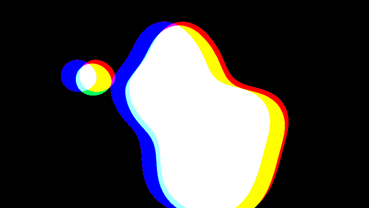
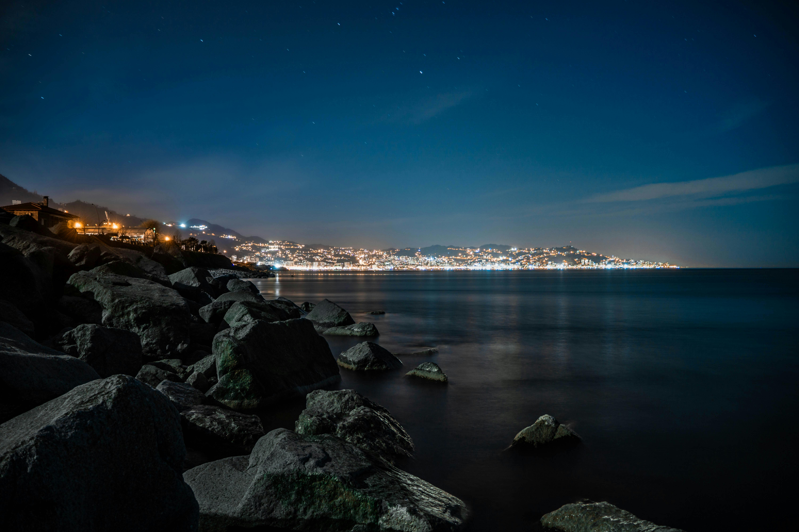
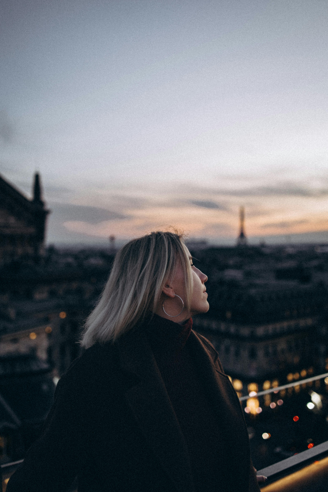

# WallCLI




Welcome to the Wallpaper CLI Tool! This tool allows you to fetch and set beautiful wallpapers from various sources like Pexels, Unsplash, NASA APOD, and Reddit. You can also generate custom wallpapers using Stable Diffusion. The tool is designed to be user-friendly and highly customizable.

# Example fetched and Generated Wallpapers:




## Folder Structure

```
wallpaper-cli-tool/
├── src/
|   |---wallpapers/
|   |      |-- nature.jpg 
|   |      |-- sea.png 
|   |      |-- sea2.png 
│   ├── generator.py          # Custom wallpaper generation using Stable Diffusion
│   ├── main.py               # Main entry point for CLI
│   ├── nasa_apod_api.py      # Fetch wallpapers from NASA APOD
│   ├── pexels_api.py         # Fetch wallpapers from Pexels
│   ├── reddit_api.py         # Fetch wallpapers from Reddit
│   ├── tui.py                # Terminal User Interface
│   ├── tui_style.css         # Styles for TUI
│   ├── unsplash_api.py       # Fetch wallpapers from Unsplash
│   └── wallpaper_setter.py   # Set and manage wallpapers
├── requirements.txt          # Project dependencies
├── wallpaper_history.txt     # History of wallpapers
└── test images               # Test images used in the project
└── Wallpapers                # Project Wallpapers 
└── README.md                 # Project documentation
```


## Features

**✨ - Fetch wallpapers from multiple sources: Pexels, Unsplash, NASA APOD, and Reddit.**

**✨ - Terminal User Interface (TUI) for easy interaction. for normal PC or windows users**

**✨ - Generate custom wallpapers using Stable Diffusion.**

**✨ - Set wallpapers directly from the command line.**

**✨ - Maintain a history of wallpapers.**

**✨ - Fetch Previous and Next Wallpapers**


## Installation

1. Clone the repository:

    ```sh
    git clone https://github.com/Blacksujit/WallCLI.git
    
    cd wallpaper-cli-tool
    ```

2. Install the required dependencies:

    ```sh
    pip install -r requirements.txt
    ```

## Usage

### Command Line Interface: (For techies)

**navigate to:**

```cd src
```

**Fetch and set a wallpaper from Pexels:**

```sh
python main.py --set-wallpaper "hindu Spirituality" --orientation "landscape" --resolution "1920x1080" --monitor 0

```

**Set Wallpaper from Various Sources like Reddit , unsplash , Nasa apod:**

```sh
python main.py --set-wallpaper "A beautiful sunset" --source reddit
```

```sh
python main.py --set-wallpaper "A beautiful sunset" --source unsplash
```

```sh
python main.py --set-wallpaper "A beautiful sunset" --source nasa
```

**Set Previous used wallpaper:**

```sh

python main.py --previous 2 --monitor 0

```

**Generate a custom wallpaper:**

```sh
python main.py --source custom --query "a beautiful sunset" --resolution "1024x1024"

```
**Retrive the wallpaper History:**

```sh
python main.py --list-history
```

### Terminal User Interface (For Normal users non techies)

##### **Run the TUI:**

```sh
python src/tui.py
```

***Use the TUI to select predefined queries, enter custom queries, and fetch wallpapers.***


## Example Use Case

Imagine you want to refresh your desktop wallpaper every day with a new image of nature. You can set up a cron job (on Unix-based systems) or a scheduled task (on Windows) to run the following command daily:

```sh
python src/main.py --source pexels --query "nature" --orientation "landscape" --resolution "1920x1080"
```

This will automatically fetch a new nature wallpaper from Pexels and set it as your desktop background.

## Contributing

Contributions are welcome! Please fork the repository and submit a pull request.

## License

This project is licensed under the MIT License.

**Enjoy your new wallpapers!**

